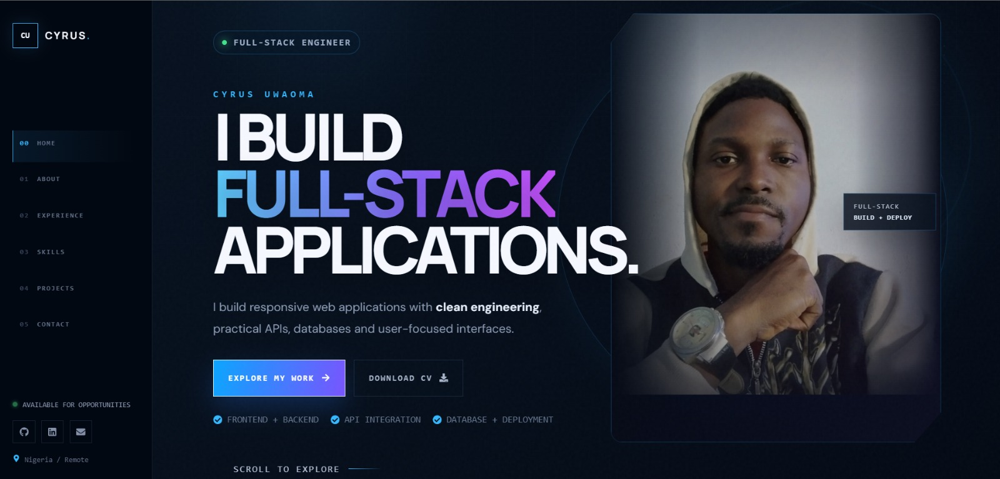

# Cyrus Uwaoma — Full-Stack Software Engineer Portfolio



## Overview

This repository contains the source code for my personal portfolio website — a modern, interactive portfolio designed to showcase my work as a **Full-Stack Software Engineer**.

The portfolio goes beyond displaying projects. It is designed to demonstrate how I approach software engineering through **frontend development, backend architecture, API integration, database systems, authentication, responsive design, deployment, and user-focused product development**.

> I build full-stack applications that turn ideas and real-world problems into usable digital products.

---

## 🚀 Live Portfolio

**Portfolio:**  
https://cyrus-portfolio-01.netlify.app/

**GitHub:**  
https://github.com/CyCodez

**LinkedIn:**  
https://www.linkedin.com/in/uwaomacyrus/

---

## ✨ Features

### Interactive Hero Section

The landing section introduces my engineering focus with:

- Full-Stack Engineer positioning
- Animated typography
- Profile presentation
- Interactive visual effects
- Technology highlights
- Call-to-action buttons
- CV download
- Responsive layout

### About

A concise overview of my engineering background, development approach, and technical capabilities.

### Engineering Skills

The portfolio showcases my experience across:

- Frontend development
- Backend development
- Database systems
- API development
- Authentication
- Third-party integrations
- Deployment
- Version control

### Project Showcase

Projects are presented as real applications rather than simple screenshots.

Each project communicates:

- The problem being solved
- The technology used
- Key functionality
- Engineering approach
- Live application
- Source code

### Responsive Design

The portfolio is designed to work across:

- Desktop
- Laptop
- Tablet
- Mobile devices

### Animation & Interaction

The interface uses carefully controlled animations and transitions to create a more engaging experience while maintaining usability.

Animations include:

- Scroll reveal effects
- Hover interactions
- Card transitions
- Navigation interactions
- Animated technology elements
- Background effects
- Button interactions

### Accessibility & Motion Considerations

The interface includes responsive behavior and reduced-motion considerations to provide a better experience for users who prefer minimal animation.

---

# 🛠️ Technology Stack

## Frontend

- HTML5
- CSS3
- JavaScript
- React.js
- React Icons

## Backend & APIs

- Node.js
- Express.js
- REST APIs
- API Integration
- Authentication

## Database & Cloud Services

- MongoDB
- Firebase
- Cloud Firestore

## Development Tools

- Git
- GitHub
- npm
- Vite
- Postman

## Deployment

- Netlify
- Render
- Firebase Hosting

---

# 📂 Featured Projects

## 🌐 NetworkLens

**IP Intelligence Explorer**

NetworkLens is a full-stack application that transforms public IP addresses into useful geographic and network intelligence.

### Features

- IP address lookup
- Geographic information
- Country and city detection
- Region and timezone information
- ISP/network information
- Geographic coordinates
- Interactive map
- Search history

### Technologies

`React` `Node.js` `Express.js` `REST API` `Leaflet`

**Live:**  
https://networklenz.netlify.app/

**Source:**  
https://github.com/CyCodez/NetworkLens

---

## 🏥 CareFinder

**Healthcare Discovery Application**

CareFinder is a healthcare discovery application designed to help users discover healthcare providers, inspect provider information, and manage appointment requests.

### Features

- Healthcare provider discovery
- Location-based search
- Provider information
- Interactive map
- Authentication
- Appointment requests
- User dashboard
- Appointment management
- Firestore data management

### Technologies

`React` `Firebase` `Firestore` `REST APIs` `Location APIs`

**Live:**  
https://carefinder-application.web.app/

**Source:**  
https://github.com/CyCodez/Carefinder-Application

---

## 💳 BankRecharge

**Full-Stack Banking & Recharge Application**

BankRecharge is a full-stack application built around authentication, user workflows, backend services, database operations, and application functionality.

### Technologies

`React` `Node.js` `Express.js` `MongoDB` `REST APIs`

**Live:**  
https://bankrecharge.netlify.app/

**Source:**  
https://github.com/CyCodez/BankRecharge-FullStack

---

## 🎓 Student Management System

A full-stack application for managing student-related information and database operations.

### Technologies

`React` `Node.js` `MongoDB` `REST APIs`

**Live:**  
https://student-database-frontend-elsx.onrender.com

**Source:**  
https://github.com/CyCodez/student_database_db

---

## 🍕 Pizza Application

A responsive React application focused on dynamic UI rendering, reusable components, application state, and user interaction.

### Technologies

`React` `JavaScript` `CSS`

**Live:**  
https://cy-pizza-app.netlify.app/

**Source:**  
https://github.com/CyCodez/pizza-menu

---

## ✈️ Travel List

A React application for managing and organizing travel-related items and activities.

### Technologies

`React` `JavaScript` `CSS`

**Live:**  
https://travel-list-app01.netlify.app/

**Source:**  
https://github.com/CyCodez/travel-app

---

## 🌍 Tourist Website

A responsive tourism-focused web application demonstrating frontend development, responsive layouts, reusable UI components, and interactive interfaces.

### Technologies

`HTML` `CSS` `JavaScript`

**Live:**  
https://tour-project-01.netlify.app/

**Source:**  
https://github.com/CyCodez/Tour-project

---

# 🧠 Engineering Approach

I approach software development by thinking about the complete lifecycle of an application.

```text
Problem
   ↓
Understand the User
   ↓
Design the Experience
   ↓
Build the Interface
   ↓
Develop APIs & Business Logic
   ↓
Design the Database
   ↓
Integrate External Services
   ↓
Test & Debug
   ↓
Deploy
   ↓
Improve

My goal is not simply to make an application work.

I aim to build software that is:

Usable
Maintainable
Responsive
Scalable
Secure
Practical
Focused on solving a real problem


src/
│
├── assets/
│   ├── profile-pics.jpeg
│   └── project assets
│
├── components/
│   └── reusable UI components
│
├── sections/
│   ├── Hero
│   ├── About
│   ├── Skills
│   ├── Projects
│   └── Contact
│
├── App.jsx
├── App.css
└── main.jsx
│
├── index.html
└── package.json


🎨 Design System

The visual direction combines a dark technology-inspired interface with:

Deep navy backgrounds
Electric blue accents
Blue-to-purple gradients
Glass-inspired surfaces
Technical grid patterns
Glowing borders
Large display typography
Monospace technical elements
Subtle ambient effects

The design intentionally communicates software engineering, technology, and modern digital products rather than following a conventional portfolio template.

⚙️ Getting Started
Prerequisites

Make sure you have installed:

Node.js
npm
Git

You can verify your installation with:

node --version
npm --version
git --version


Installation

Clone the repository:

git clone https://github.com/CyCodez/Cyrus-Portfolio.git

Navigate into the project:

cd Cyrus-Portfolio

Install dependencies:

npm install

Start the development server:

npm run dev

The application will then be available through the local Vite development URL.

🏭 Production Build

Create a production build:

npm run build

Preview the production build locally:

npm run preview
🔐 Environment Variables

Some projects displayed in the portfolio may use external APIs or environment variables.

For example:

VITE_API_URL=your_api_url
VITE_API_KEY=your_api_key

Do not commit private API keys, credentials, or secrets to GitHub.

Use environment variables for sensitive configuration.

📱 Responsive Experience

The portfolio adapts its layout based on screen size.

Desktop
Fixed navigation
Split hero layout
Large typography
Project showcase
Technology animations
Tablet
Adaptive spacing
Flexible grids
Adjusted typography
Mobile
Compact navigation
Stacked sections
Responsive project cards
Mobile-friendly buttons
Optimized typography
🎯 Purpose

This portfolio was built to serve two purposes:

1. Professional Portfolio

To provide recruiters, hiring managers, developers, and potential collaborators with a clear overview of my technical abilities and projects.

2. Engineering Demonstration

The portfolio itself demonstrates my ability to:

Build React applications
Create responsive interfaces
Structure reusable components
Work with APIs
Integrate external services
Implement interactive experiences
Manage application state
Work with authentication
Deploy web applications
Think about software from both technical and user perspectives
📈 Continuous Development

The portfolio is an evolving project.

As I continue developing my engineering skills, I plan to improve areas such as:

Advanced TypeScript
Scalable backend architecture
Advanced API design
Application security
Cloud services
Testing
Performance optimization
Advanced database architecture
System design
👨‍💻 About Me

I'm Cyrus Uwaoma, a Full-Stack Software Engineer focused on building practical digital products.

My development experience covers:

Frontend
   ↓
HTML • CSS • JavaScript • React
   ↓
Backend
   ↓
Node.js • Express.js
   ↓
APIs
   ↓
REST APIs • Third-Party Integrations
   ↓
Database
   ↓
MongoDB • Firebase • Firestore
   ↓
Deployment
   ↓
Netlify • Render • Firebase Hosting

I hold a Diploma in Frontend Engineering from AltSchool Africa and continue to expand my full-stack engineering knowledge through NIIT.

🤝 Let's Connect

If you're interested in software engineering, product development, collaboration, or simply want to connect, feel free to reach out.

GitHub:
https://github.com/CyCodez

LinkedIn:
https://www.linkedin.com/in/uwaomacyrus/

Email:
uwaomacyruz@gmail.com

